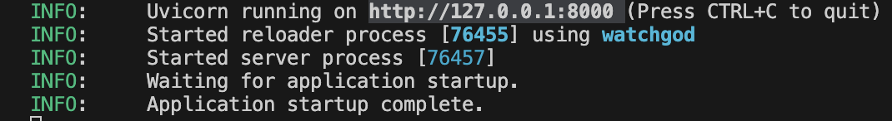
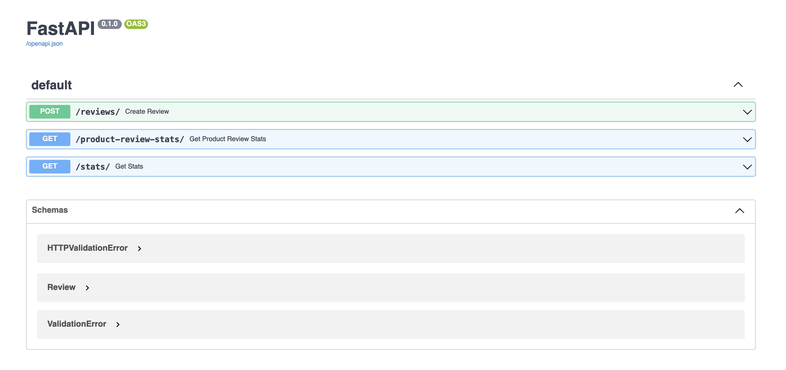
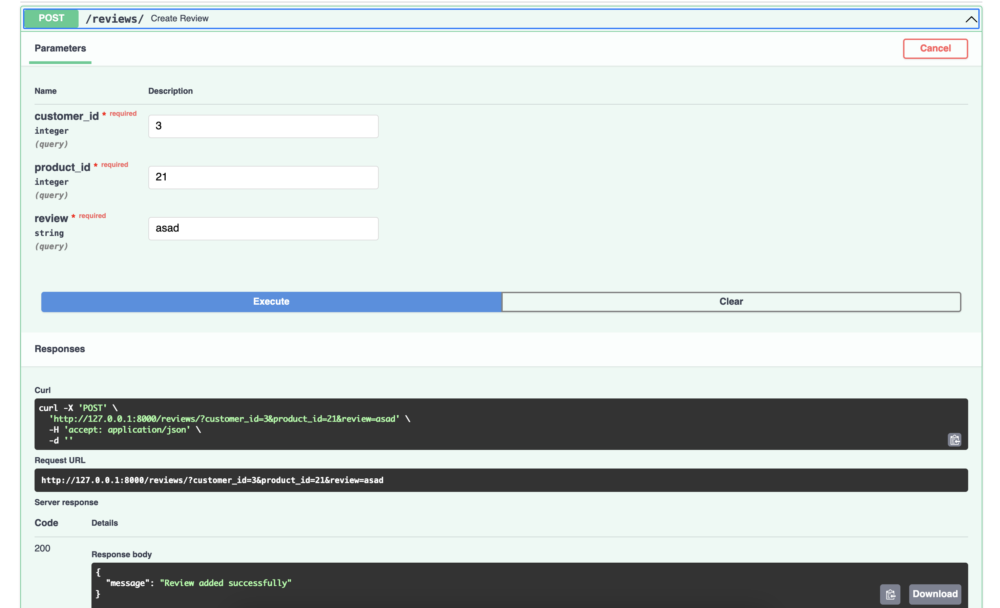
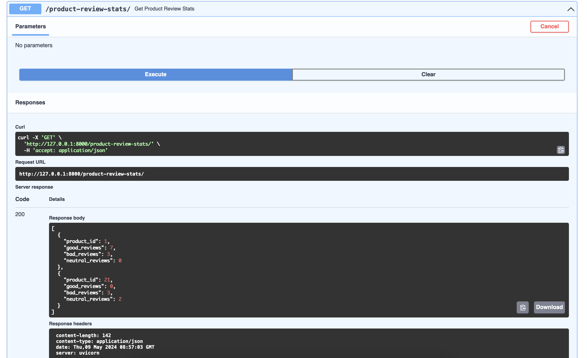
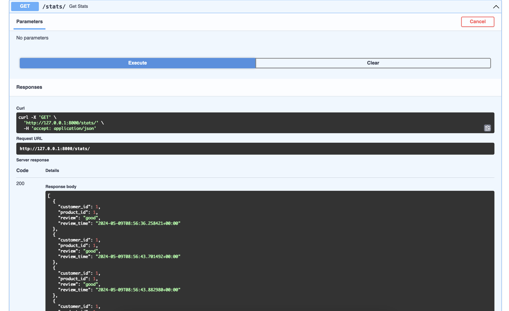

#########################
This repo is about how to create a basic FastAPI that analyses product reviews

Steps to run the fastapi
1) Create a python virtual environment
python -m venv venv
2) Activate python virtual environment
source venv/bin/activate
3) Install all requirements
pip install -r requirements.txt
4) Run fastapi using below command
uvicorn src_app:app --reload
This command would start your fastapi on your localhost (http://127.0.0.1:8000 )

FastAPI provides an interactive documentation page to which you can navigate by simply going to docs endpoint (http://127.0.0.1:8000/docs)
This would show you all the endpoints which you can try out for yourself to see if your api is functioning correctly

Adding a review:

Get product review stats:

Get overall stats:

Note: As we are using a dictionary to store reviews, the data would be gone after each review. For production use, the data should be stored in a database or s3 bucket and the analysis should use proper machine learning models to identify the reviews

    